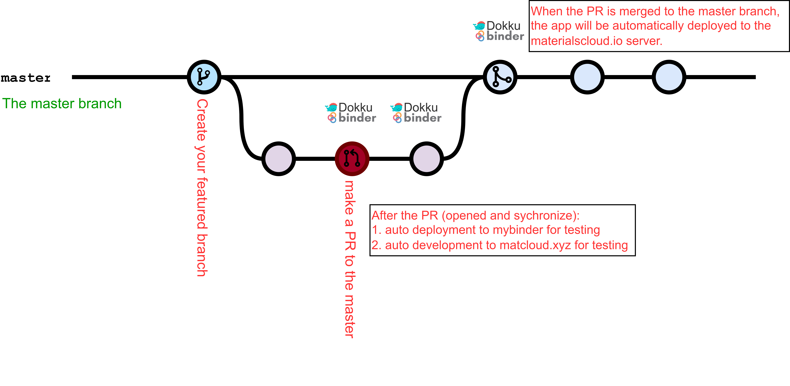

# **Interactive Notebooks: Quantum Mechanics and Computational Materials Science**
[](https://github.com/osscar-org/quantum-mechanics/actions/workflows/voila-test.yml)

## Introduction 

This is a repository for tutorials in quantum mechanics and
computational materials science. Jupyter notebooks are converted into
interactive web applications. Professors can use them to demonstrate knowledge
in the classroom. Students can also use them for self-learning.


* Try on `Materials Cloud` (fast, a few seconds to load) [](https://osscar-quantum-mechanics.materialscloud.io)


## Local installation

One can clone this repository and install all the required packages locally.
To do so (ideally in a fresh python virtual environment, to reduce risks of version clashes of some of the dependencies), run the following commands:

```bash
git clone https://github.com/osscar-org/quantum-mechanics.git
cd quantum-mechanics
pip install -r requirements.txt
```

Then, to view the notebooks in the form of a web application, you can type
the following command in the terminal:

```bash
voila --template=osscar --VoilaConfiguration.enable_nbextensions=True notebook/
```

This will start the voila server and then open your default browser, where you can use the web application.

## Content

### Section 1: Quantum Mechanics

Here are the tutorials to demonstrate numerical solution for 1D Schrödinger
equation.

| Name       | Description           | Notebook links  | Materials Cloud | 
| ------------- |:-------------:| -----:| -----:|
| One Quantum Well | The solution for 1 quantum well | [One Quantum Well](./notebook/quantum-mechanics/1quantumwell.ipynb) | [](https://osscar-quantum-mechanics.materialscloud.io/voila/render/quantum-mechanics/1quantumwell.ipynb) |
| Two Quantum Wells | The solution for 2 quantum wells | [Two Quantum Wells](./notebook/quantum-mechanics/2quantumwells.ipynb) | [](https://osscar-quantum-mechanics.materialscloud.io/voila/render/quantum-mechanics/2quantumwells.ipynb) |
| Asymmetric Well | Avoided crossing in an asymmetric well | [Asymmetric Well](./notebook/quantum-mechanics/asymmetricwell.ipynb) | [](https://osscar-quantum-mechanics.materialscloud.io/voila/render/quantum-mechanics/asymmetricwell.ipynb) | Shooting method | Shooting method with Numerov algorithm | [Shooting method](./notebook/quantum-mechanics/shooting_method.ipynb) [](https://osscar-quantum-mechanics.materialscloud.io/voila/render/quantum-mechanics/shooting_method.ipynb) |
| SOFT | Split operator Fourier transform method | [SOFT](./notebook/quantum-mechanics/soft.ipynb) | [](https://osscar-quantum-mechanics.materialscloud.io/voila/render/quantum-mechanics/soft.ipynb) |
| MSOFT | Multiple Split operator Fourier transform method | [MSOFT](./notebook/quantum-mechanics/msoft.ipynb) | [](https://osscar-quantum-mechanics.materialscloud.io/voila/render/quantum-mechanics/msoft.ipynb) |

### Section 2: Band Theory of Crystals

Here are the tutorials to demonstrate the band theory of crystal systems.

| Name       | Description           | Notebook links  | Materials Cloud | 
| ------------- |:-------------:| -----:| -----:|
| FFT and Planewaves | Fourier Transforms and Plane-Wave Expansions | [FFT and Planewaves](./notebook/band-theory/FFT_and_planewaves.ipynb) | [](https://osscar-quantum-mechanics.materialscloud.io/voila/render/band-theory/FFT_and_planewaves.ipynb) |
| Free Electron | Free-electron Bands in a Periodic Lattice | [Free Electron](./notebook/band-theory/free_electron.ipynb) | [](https://osscar-quantum-mechanics.materialscloud.io/voila/render/band-theory/free_electron.ipynb) |
| Density of States | Density of States (DOS) | [Density of States](./notebook/band-theory/density_of_states.ipynb) | [](https://osscar-quantum-mechanics.materialscloud.io/voila/render/band-theory/density_of_states.ipynb) |
| Pseudopotentials | Norm-conserving pseudopotentials | [Pseudopotentials](./notebook/band-theory/pseudopotential.ipynb) | [](https://osscar-quantum-mechanics.materialscloud.io/voila/render/band-theory/pseudopotential.ipynb) |
| Brillouin Zone | Brillouin Zone | [Brillouin Zone](./notebook/band-theory/brillouin_zone.ipynb) | [](https://osscar-quantum-mechanics.materialscloud.io/voila/render/band-theory/brillouin_zone.ipynb) |


### Section 3: Molecule and Lattice Vibration
| Name       | Description           | Notebook links | Materials Cloud | 
| ------------- |:-------------:| -----:| -----:|
| Phonon 1D | lattice vibration for one dimensional system | [Phonons 1D](./notebook/lattice-vibration/Phonon_1D.ipynb)  | [](https://osscar-quantum-mechanics.materialscloud.io/voila/render/lattice-vibration/Phonon_1D.ipynb) |
| Phonon 2D | lattice vibration for two dimensional systems | [Phonon 2D](./notebook/lattice-vibration/Phonon_2D.ipynb) | [](https://osscar-quantum-mechanics.materialscloud.io/voila/render/lattice-vibration/Phonon_2D.ipynb) |
| Molecular Vibrations | introduce to molecular vibrations | [Molecular Vibration](./notebook/lattice-vibration/Molecule_Vibration.ipynb) | [](https://osscar-quantum-mechanics.materialscloud.io/voila/render/lattice-vibration/Molecule_Vibration.ipynb) |

### Section 4: Molecular Dynamics

| Name       | Description           | Notebook links  | Materials Cloud | 
| ------------- |:-------------:| -----:| -----:|
| Verlet integration | Verlet integration | [Verlet Integration](./notebook/molecular-dynamics/verlet_integration.ipynb) | [](https://osscar-quantum-mechanics.materialscloud.io/voila/render/molecular-dynamics/verlet_integration.ipynb) |

### Section 5: Statistical Mechanics

| Name       | Description           | Notebook links  | Materials Cloud | 
| ------------- |:-------------:| -----:| -----:|
| Metropolis Monte Carlo | Metropolis-Hastings Monte Carlo | [Metropolis Monte Carlo](./notebook/statistical-mechanics/monte_carlo_parabolic.ipynb) | [](https://osscar-quantum-mechanics.materialscloud.io/voila/render/statistical-mechanics/monte_carlo_parabolic.ipynb) |
| Monte Carlo Integration | Monte Carlo Integration | [Monte Carlo Integration](./notebook/statistical-mechanics/monte_carlo_pi.ipynb) | [](https://osscar-quantum-mechanics.materialscloud.io/voila/render/statistical-mechanics/monte_carlo_pi.ipynb) |
| Ising Model | Ising Model | [Ising Model](./notebook/statistical-mechanics/ising_model.ipynb) | [](https://osscar-quantum-mechanics.materialscloud.io/voila/render/statistical-mechanics/ising_model.ipynb) |

## How to contribute

If you would like to contribute a new notebook to OSSCAR, see the [guide to contributing](https://www.osscar.org/code/contributing.html) on our website, where you can also find an example [notebook template](https://www.osscar.org/code/sample_notebook.html). 

Note: the workflow for contributing a new notebook or modifying an existing notebook is as follows. First, ensure that you are up to date with the master branch by running
```bash
git checkout master
git pull        
```        
You can then go ahead and create a branch off master to work on your new notebook or modifying an existing notebook
```bash
git checkout -b new_notebook_branch
```
After making your changes, you can push this new branch to the remote quantum-mechanics repo and open a pull request for this branch to be merged with the master branch. After review, it can be merged and automatically deployed to the materials cloud server. This process is illustrated below.

## Development



When you decide to extend or modify the notebook, please create a new branch
from the current master branch by:

```bash
git checkout master
git branch your-branch
```

Once you create a pull request from your branch to the master, the workflows
will automatically deploy the apps to the matcloud.xyz server.
(it needs to pass the voila test workflow). You can check and review the deployed apps.

After merging the PR to the master branch, the web apps will be automatically
deployed to the materialscloud.io server.

## How to cite

When using the content of this repository, please cite the following article:

 D. Du, T. Baird, S. Bonella and G. Pizzi, OSSCAR, an open platform for collaborative development of computational tools for education in science, *Computer Physics Communications*, **282**, 108546 (2023).
https://doi.org/10.1016/j.cpc.2022.108546
## Acknowledgements

We acknowledge support from the EPFL Open Science Fund via the [OSSCAR](http://www.osscar.org) project.


